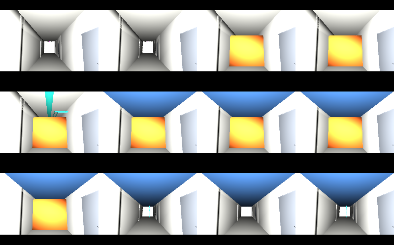

# usdAecoPlan — programmes, workspace checks and derived 4D playback

## Use case

Closing a ceiling before first fix and inspection causes avoidable rework.
A bathroom pod parked in the corridor can also block the next trade's workspace.
This library connects stored programme dates to model scopes and checks those
conflicts; the [worked use case](docs/usecase.md) explains the complete example.

## The schema on an index card

| Schema | Contract |
|---|---|
| `AecoProgramme` | Identity, members, epoch, timeCodesPerDay, dataDate, source and programme bounds |
| `AecoActivity` | WBS nesting, members as scope, taskType, ordered multiedge predecessorIds/lagDays/linkType; derived predecessors |
| `AecoMilestone` | An activity event |
| `AecoScheduleAPI` | Planned, baseline and actual start/finish; percentComplete |
| `AecoWorkspaceAPI` | requiresAccess, encloses, occupies, accessVia |

Properties use the declared `aeco:plan:`, `aeco:schedule:` and
`aeco:workspace:` namespaces. Identity remains `aeco:id`; membership remains
the core collection. The schema adds no geometry or product-kind vocabulary.

## The example

[Programme A and B](examples/datacentre/README.md) each contain ten activities.
A yields three named findings: two errors and one inspection warning. B is clean.
Both XER and MSPDI imports agree after documented normalization.

```sh
usdview examples/datacentre/result/example.usdc
usdview examples/datacentre/result/layers/out/A/play.usda
```

The first opens B; the second overlays A's authored and derived layers on the
same self-contained crate. Both open without family plugins or sibling checkouts.
Time codes `0, 7, …, 77` show weeks 1–12; the default-time view shows the design.



With the pinned dependencies configured below:

```sh
env -u PYTHONPATH "$PYTHON" examples/datacentre/run.py --publish
```

The committed result includes both programmes' editable layers, 4D visibility,
predecessor views, colours and placement; `renders/` contains 24 PNG frames,
two contact sheets, two GIF previews and two Gantt SVGs drawn from prims.
The example declares a 480-second runner budget in its manifest. Embree previews
default to 8 samples per pixel; each weekly frame is rendered once and reused for
the contact sheet and GIF. [Timing evidence](docs/acceptance.md) records fresh runs
at one and two USD threads and the artifact comparison.

## Build and check

Use Python 3.11+ with OpenUSD 26.8+ including UsdValidation and `usdGenSchema`, pytest,
Pillow, numpy and jinja2. Rendering needs `usdrecord` with Embree on PATH.
No package installation or setuptools is required to run from source.
Set `PYTHON` to that interpreter, then, for sibling checkouts:

```sh
export PYTHON=python3
export TOOLCHAIN_DIR=../usdaeco-toolchain
export CORE_DIR=../usdaeco-core
export CORE_PLUGIN_DIR="$CORE_DIR/usdAeco"
export AECO_DATACENTRE_ROOT=../usdaeco-datacentre
export PXR_PLUGINPATH_NAME="$CORE_PLUGIN_DIR:$PWD/usdAecoPlan:$PWD/usdAecoPlanValidators"
env -u PYTHONPATH bash build.sh
env -u PYTHONPATH PYTHONPATH="$CORE_DIR:$PWD" "$PYTHON" check.py
env -u PYTHONPATH "$PYTHON" -m pytest -q
```

Use checkouts at the exact tags in `dependencies.json`. The codeless core source
plugin carries the tagged metadata, independently of any older build output.
To measure the example
from empty output roots with those same dependencies:

```sh
env -u PYTHONPATH "$PYTHON" tools/benchmark_example.py --profile
```

The benchmark checks dependency versions, runs at `PXR_WORK_THREAD_LIMIT=1` and
`2`, and writes timings, profiles and byte-comparison evidence to ignored `out/`.
It excludes committed results and renders from each fresh source copy. The normal
runner honours an explicit `HDEMBREE_SAMPLES_TO_CONVERGENCE` quality override;
the benchmark always measures the published 8-sample default.

`check.py` fails if the core validators cannot import or load. Its final line is
`N checks, M failed, K not run`; NOT RUN is never PASS. Source CLI examples:

```sh
env -u PYTHONPATH "$PYTHON" tools/aeco-plan xer examples/datacentre/inputs/A.xer --programme-id A --scope examples/datacentre/inputs/A.scope.json --workspace examples/datacentre/inputs/A.workspace.json --stage "$AECO_DATACENTRE_ROOT/dist/pod/dc.usda" --out programme.usda
env -u PYTHONPATH "$PYTHON" tools/aeco-plan lookahead 3 examples/datacentre/result/example.usdc --start 2027-03-15
env -u PYTHONPATH "$PYTHON" tools/aeco-plan derive examples/datacentre/result/example.usdc --out 4d.usda
```

`mspdi` uses the same import options; `normalize layer.usda --out normalized.usda`
normalizes a driver layer. Installed entry points are `aeco-plan`, `xer2usdaeco`
and `mspdi2usdaeco`. Imports create a programme overlay: compose it over the
source stage before deriving visibility or validating its scope.

Set `AECO_STUDY_ROOT=/Studies/plan` to author the programme at
`/Studies/plan/Programme`. Import commands also accept `--study-root`; the Python
writer accepts `study_root=`, both overriding the environment. Ancestors are
plain `Scope` prims and each driver layer sets `defaultPrim` to its top-level
prim (`Studies` here). The default `/` preserves the committed example bytes.
Readers discover programmes from the composed data, so normalization, validation,
lookahead, predecessors and 4D playback work without retaining the setting.
The hook discovers cameras beneath `/Renders`, including suite cameras at
`/Renders/plan/A` and `/Renders/plan/B`.

The additional v0.5.2 full-stage integration fixture is recorded in
`dependencies.json`. Tests use the sibling `usdaeco-datacentre-0.5.2` checkout;
set `AECO_PLAN_TEST_STAGE` to its `dist/full/dc.usda` in another layout. The hook
uses the manifest next to `AECO_DATACENTRE_STAGE` when testing a stage override.
These tests exercise nested roots, project-catalog preservation and relocated
stock-USD playback. They report a skip if the integration fixture is unavailable.

`nix flake check` exposes library and structure checks. Public input URLs match
[dependencies.json](dependencies.json). For local inputs use an external registry
or `--override-input core path:../usdaeco-core` and equivalent toolchain, axis and
datacentre overrides, as described by the
[toolchain](https://github.com/criad-com/usdaeco-toolchain/blob/main/docs/repo-conventions.md).
Private registry files and lockfiles stay outside this repository.

## Family

Requires core `>=0.9.2,<1.0`. Checks pin core v0.9.5, axis v0.1.5,
toolchain v0.3.10 and datacentre v0.4.8 (`pod`). Axis is an integration pin;
the plan schema itself depends only on core. The published data-centre manifest
retains its own earlier converter/core provenance; no source rebuild is implied.
See the [family board](https://github.com/criad-com/usdaeco-board) and
[repository conventions](https://github.com/criad-com/usdaeco-toolchain/blob/main/docs/repo-conventions.md).

## Layout

`usdAecoPlan/` holds the codeless schema and user documentation;
`usdAecoPlanValidators/` registers eight Python UsdValidation rules.
`tools/usdaeco_plan/` contains both importers, normalization, validation, 4D,
lookahead and SVG drawing. `testenv/`, `conformance/profiles/`, `docs/` and
`examples/datacentre/` hold tests, policy and reproducible evidence.

## Status

Version 0.1.5: **51 checks, 0 failed, 2 not run; structure 29/0; 36 tests passed**.
The acceptance evidence and measured limitations are in
[docs/acceptance.md](docs/acceptance.md). Private real-project XER validation is
NOT RUN: the file is private client data and is never read by this library's
checks. GUI interaction is not claimed; stock-USD composition and sampled
visibility are the playback proof.

## Licence

[MIT](LICENSE).

Runtime dependencies retain their licences: OpenUSD
(Apache-2.0-style), numpy (BSD-3-Clause), jinja2 (BSD-3-Clause), Pillow (HPND)
and the MIT family toolchain. The planning parsers use Python's standard library.
