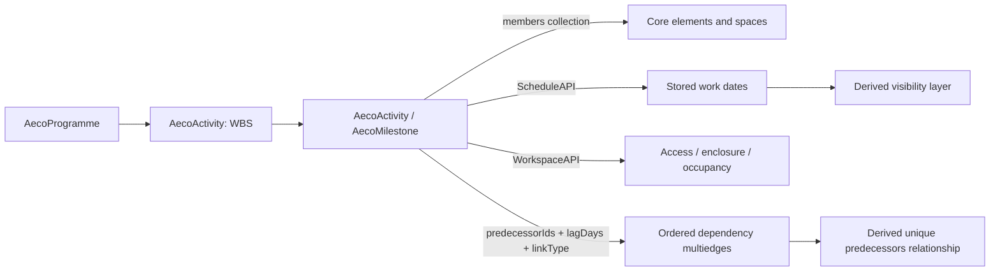
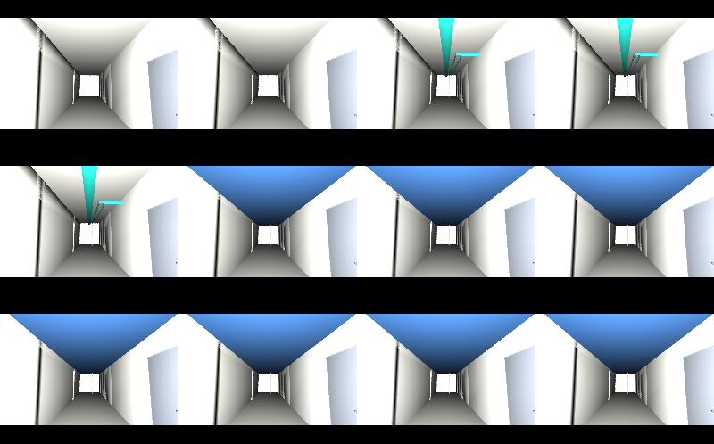

# 4D planning: the bathroom pod and the closed ceiling

## 1 The problem

A programme and a building model usually arrive as separate deliveries. The
planner can see dates without knowing which ceiling void those dates affect;
the trade coordinator can see the void without knowing when access disappears.
Closing drylining before first fix and inspection leaves work inaccessible and
creates reopening and reinstatement work. A prefabricated pod parked in a
corridor adds a second conflict: space needed by another trade is occupied.
This example demonstrates those mechanisms; it makes no quantified cost claim.

## 2 The data as it arrives

P6 XER is the primary schedule source. PROJECT becomes the programme; PROJWBS
becomes the work breakdown; TASK becomes activities or milestones. Every
TASKPRED row becomes one ordered link instance, including identical duplicates.
CALENDAR day hours convert the successor's lag hours to working days. Missing
calendar day lengths use the documented P6 default of eight hours; invalid
non-positive or non-finite lengths fail.

MSPDI is the secondary source, parsed with the standard-library XML parser.
`OutlineLevel` and summary rows build the hierarchy. PredecessorLink Types
`0/1/2/3` map to `FF/FS/SF/SS`; LinkLag is tenths of minutes, divided by
`10 * MinutesPerDay`. A missing MinutesPerDay defaults to 480. The demo has a
24-hour elapsed-day calendar, so both formats use identical lag days.

The committed scope/workspace JSON files bind activity source keys to model
identities. The demo's source-id property is an import alias only; emitted
predecessor ids and element identity use `aeco:id`. MSPDI extended attributes
supply the same activity keys, task types and scope. Other exports need matching
programme keys and bindings for cross-format identity equivalence. XER project
selection is explicit if more than one project is present. Missing/external
predecessors, invalid calendars, malformed dates and skipped outline parents
fail instead of silently discarding constraints.

Dates are retained at calendar-date precision, as in the earlier importer
contract. Intraday timestamps, calendar exceptions, resources and critical-path
outputs are outside this version. Planned, actual and supplied baseline dates
and percent complete remain independent stored values. XER baseline fields
are supported when present; separate baseline projects are not reconciled.

## 3 The model in USD

The programme and activities are identified records. Their nesting organizes
work; it never contains or reparents built elements. The core members collection
is reused for scope. The programme's members delimit the work being scheduled,
so `UnscheduledElement` checks programme members, not the entire facility.
An intentionally wider programme scope reveals unassigned elements.

`aeco:plan:predecessorIds`, `lagDays` and `linkType` are parallel authoritative
arrays in source order. `aeco:plan:predecessors` is a path-sorted unique view,
marked `aecoDerived = true` in the schema and written to its own layer. No editor
needs to maintain both encodings. Dependency cycles are checked from the ids,
even if the derived relationship is absent or stale.

Schedule dates use `aeco:schedule:` and workspace links use `aeco:workspace:`.
These namespaces and the five class prefixes are explicitly declared. Typed
records fall back to `Scope`; the model's spatial types retain their stock USD
fallbacks. This version adds programme `aeco:plan:plannedStart` and `plannedFinish`
bounds for meaningful range validation. When a source omits finish, the importer
records an activity envelope and labels that choice in programme customData;
that bound cannot independently prove the source's intended project deadline.

## 4 Workflow

1. Configure the [source environment](../README.md#build-and-check) and build
   the resource plugin with `env -u PYTHONPATH bash build.sh`.
2. Import XER with `tools/aeco-plan xer`, or MSPDI with `tools/aeco-plan mspdi`,
   supplying the same `--programme-id`, `--scope`, `--workspace` and `--stage`.
   The output contains driver opinions only.
3. Compose the programme overlay over the source stage. Run
   `tools/aeco-plan validate composed.usda`, or load keyword
   `UsdAecoPlanValidators` through UsdValidation / usdchecker.
4. Run `tools/aeco-plan derive composed.usda --out 4d.usda`. Compose the
   generated 4D and predecessor layers above the drivers. Dates remain unchanged.
5. Query `tools/aeco-plan lookahead 3 composed.usda --start 2027-03-15` for
   activities intersecting the following three weeks. Without `--start`, the
   source dataDate is used, then the programme epoch.
6. Reproduce and publish the complete demo using
   `env -u PYTHONPATH "$PYTHON" examples/datacentre/run.py --publish`.

CLI commands above run as `env -u PYTHONPATH "$PYTHON" tools/aeco-plan …` from
source. `normalize` removes only programme displayName and source-format
provenance from driver layers. No dates, WBS nodes, ids, link rows, progress,
workspace targets or scope are stripped. Equivalence is the UTF-8 bytes of the
resulting Sdf layer serialization, not a count comparison.

## 5 Validation

| Rule | Severity | Condition |
|---|---|---|
| AccessAfterEnclosure | error | Required access continues after the enclosing activity starts |
| WorkspaceOccupied | error | Required access/accessVia and occupancy share a space in inclusive overlapping date windows |
| EnclosureBeforeInspection | warn | No direct attendance predecessor over the enclosed region finishes by enclosure start |
| PredecessorCycle | error | Authored predecessor ids contain a directed cycle |
| DanglingScope | error | A scope or workspace target does not resolve |
| UnscheduledElement | warn | An element in programme membership has no scheduled activity |
| TemporaryWithoutRemoval | warn | A temporary programme element lacks a dated removal activity |
| DatesOutsideProgramme | error | Missing, malformed, reversed or out-of-bounds planned dates, or invalid programme bounds/clock |

All eight are stage validators in the Python UsdValidation plugin. A single
finding per rule/programme retains all affected sites and an occurrence count.
Every rule has a clean fixture, an observable seeded defect and a registry-based
assertion. Inspection is an `attendance` activity over the same region; names
are never parsed to guess that it is an inspection. Occupancy uses declared
spaces and dates, not a geometric access-route calculation.

## 6 The example on the demo data centre

Inputs are generated from the pinned v0.4.2 `pod` schedule generator in an
isolated copy, then committed here. The example composes
`AECO_DATACENTRE_ROOT/dist/pod/dc.usda`. Its census is compared to the adjacent
`dc.manifest.json`: 2,977 elements, 35 spaces, two levels, 3,012 meshes and
6,238 ports. No base-facility count is assumed by the runner.

Each programme has ten dated activities and three WBS nodes. A stores nine
link instances; B stores ten. A reports three named categories: access (four
activity/region pairs, including inspection access), workspace occupancy (one
pair), and missing prior inspection (two enclosures). That is **two errors and
one warning**, preserving the rule's declared severity. B has zero planning
findings. The published source contributes two proxy-classification warnings
under core validation; both programmes have zero core errors.

The 4D layer controls 23 scope targets. Week 1 is timeCode 0, then one frame
per seven elapsed days through week 12 at 77. A's temporary pod is visible in
weeks 3–9; B's in weeks 3–5. First fix appears in week 5 for A and week 3 for B.
The corridor ceiling appears in week 6 for both. The final pod appears in week
10 for A and week 6 for B. These are sampled visibility checks in a relocated
plugin-free stage, independently compared to the source dates.

The camera sits in the office corridor and looks toward the ceiling void.
Presentation colours distinguish the amber temporary pod, blue ceiling and
teal services. B's temporary position is shown in the office using a separate
presentation transform from the supplied placement data. It preserves identity
and namespace; it is a view of the programme, not a revised spatial model.

[Programme A Gantt](../examples/datacentre/renders/A.gantt.svg) ·
[Programme B Gantt](../examples/datacentre/renders/B.gantt.svg).
The [example README](../examples/datacentre/README.md) identifies every entry point.

## 7 Trade-offs and alternatives

Work records intentionally reuse AecoGroupBase identity and membership as
specified by this schema contract. This is an explicit exception to the core's
closed group-subclass rule for new programme/activity referents; it adds no
spatial type, system kind or alternative membership mechanism. The package tier
is `kind` for release metadata, while its work dates belong to records.

A programme-boundary extension avoids pretending the epoch also specifies a
finish. A missing source finish still limits what a range check can prove.
Date precision makes both input formats comparable but does not preserve
intraday sequencing. Lag rows preserve constraints without attempting to solve
them; the original planning application remains responsible for calendars and
critical path. No promise of schedule-format round-trip export is made.

Visibility uses stored starts (actualStart when supplied, otherwise plannedStart).
Construction/installation/move creates visibility; removal/demolition removes
it. Temporary works are separate elements with normal install/removal activities.
Playback visibility uses half-open install/removal intervals; workspace conflicts
use inclusive date windows because the source is date-precision. The stage's
frames-per-second is preserved so USD sublayer composition does not rescale the
calendar-derived time codes. Default-time rendering shows the complete design.

## 8 Out of scope and open questions

No CPM engine, calendar exception evaluator, resources, personal assignments,
source-format writer, route-finding engine or custom viewer is included. A native
schedule file-format plugin remains future work. External predecessor links
must be resolved before import. Placement overrides illustrate the supplied
programme and do not change the building's authoritative spatial hierarchy.
An API-only alternative to the record-base exception needs a family-level
schema decision rather than an implicit change here.

The private real-project XER row is NOT RUN: that file is private client data
and is never read for these checks. GUI playback interaction and unresolved Nix
builds are not claimed as tested.

## 9 Status

Version 0.1.3. See [acceptance evidence and deviations](acceptance.md) for measured
checks, tests, render inventory and remaining work. Generated schemas, normalized
imports, driver/derived separation and the committed example are reproducible
against the exact pins in dependencies.json.
